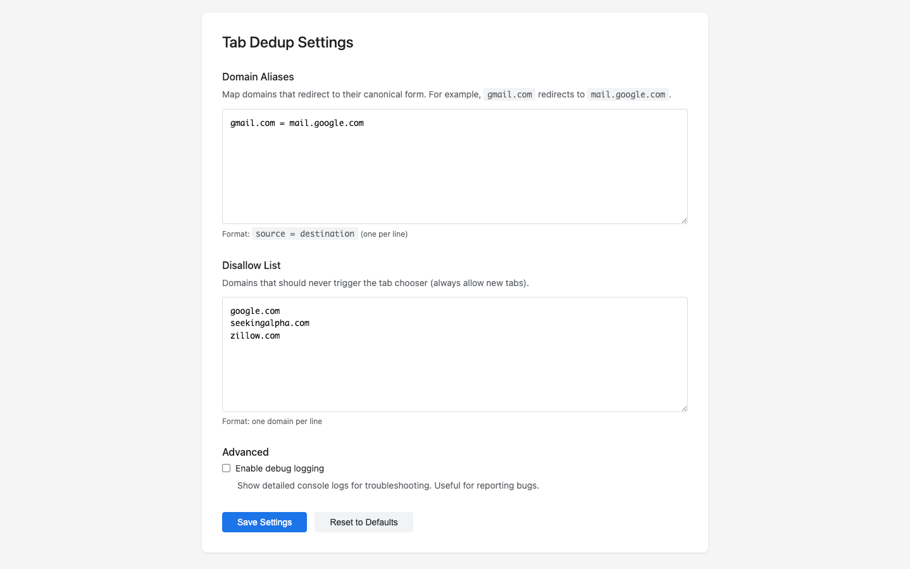

# Tab Dedup

Automatically detects duplicate tabs and offers to switch to existing tabs instead of opening duplicates. Helps reduce tab clutter and memory usage.

## Screenshots

### Tab Chooser


When you navigate to a URL that's already open, Tab Dedup shows you all matching tabs and lets you choose.

### Settings


Configure domain aliases, disallow list, and debug mode.

## Features

- **Automatic Detection**: Intercepts new tab navigations and checks for existing tabs with the same domain
- **Interactive Chooser**: Shows a list of existing tabs when duplicates are found
- **Keyboard Navigation**: Full keyboard support (↑↓ to navigate, Enter to confirm, Esc to close)
- **Domain Aliases**: Configure custom domain mappings (e.g., `gmail.com` → `mail.google.com`)
- **Disallow List**: Exclude specific domains from duplicate detection
- **Debug Mode**: Optional detailed logging for troubleshooting
- **Chrome Sync**: Settings sync across devices using Chrome sync storage

## Installation

### From Chrome Web Store

*(Coming soon - extension will be available on the Chrome Web Store)*

### From Source (Development)

1. Clone or download this repository
2. Open Chrome and navigate to `chrome://extensions/`
3. Enable "Developer mode" (toggle in top right)
4. Click "Load unpacked"
5. Select the `tab-dedup` directory

## Usage

### Basic Operation

1. Open a new tab (Ctrl+T / Cmd+T)
2. Navigate to any website
3. If a tab with the same domain already exists, Tab Dedup will show a chooser interface
4. Use arrow keys (↑↓) to select an existing tab or choose "Open new tab"
5. Press Enter to confirm your selection
6. Press Esc to cancel and close the tab

### Keyboard Shortcuts

- **↑ / ↓**: Navigate between options
- **Enter**: Confirm selection
- **Esc**: Cancel and close the tab
- **Mouse click**: Click any option to select and confirm

## Configuration

Access settings by right-clicking the extension icon and selecting "Options", or navigate to `chrome://extensions/` and click "Details" → "Extension options".

### Domain Aliases

Map domains that redirect to their canonical form. This ensures the extension recognizes redirects as duplicates.

**Format**: `source = destination` (one per line)

**Example**:
```
gmail.com = mail.google.com
docs.google.com = drive.google.com
youtu.be = youtube.com
```

### Disallow List

Domains that should never trigger the tab chooser. The extension will always allow new tabs for these domains.

**Format**: One domain per line

**Example**:
```
google.com
stackoverflow.com
github.com
```

**Use cases**:
- Search engines where you want multiple tabs
- Sites where each tab represents a different session or context
- Development servers (e.g., `localhost`)

### Debug Mode

Enable detailed console logging for troubleshooting. Useful when reporting bugs or investigating unexpected behavior.

1. Go to extension options
2. Scroll to "Advanced" section
3. Check "Enable debug logging"
4. Save settings

Debug logs will appear in the browser console (F12 → Console tab).

## Icon Requirements

This extension requires three icon files in PNG format:

- **16×16 pixels**: `icons/icon16.png` - Toolbar icon
- **48×48 pixels**: `icons/icon48.png` - Extensions page icon
- **128×128 pixels**: `icons/icon128.png` - Chrome Web Store icon

See `icons/ICON_REQUIREMENTS.md` for detailed design guidelines.

## Privacy

Tab Dedup respects your privacy:

- **No external servers**: All processing happens locally in your browser
- **No telemetry**: The extension does not collect or transmit any usage data
- **No tracking**: No analytics, no user tracking, no third-party services
- **Local storage only**: Configuration is stored using Chrome's sync storage API
- **Open source**: All code is available for inspection in this repository

The only data stored is your configuration settings (domain aliases, disallow list, debug mode), which are synced via Chrome's built-in sync mechanism if you're signed into Chrome.

**Full privacy policy**: See [PRIVACY.md](PRIVACY.md) for complete details.

## Development

### Project Structure

```
tab-dedup/
├── manifest.json          # Extension manifest (MV3)
├── background.js          # Service worker - core logic
├── options.html           # Settings page HTML
├── options.css            # Settings page styles
├── options.js             # Settings page logic
├── chooser/
│   ├── chooser.html       # Tab chooser UI
│   ├── chooser.css        # Tab chooser styles
│   └── chooser.js         # Tab chooser logic
├── icons/                 # Extension icons (16, 48, 128 px)
├── Makefile               # Build automation (packaging, validation)
├── LICENSE                # GPL v3 license
├── README.md              # This file
├── PRIVACY.md             # Privacy policy
└── CLAUDE.md              # AI development guide
```

### Architecture

- **Manifest V3**: Uses modern Chrome extension architecture
- **Service Worker**: `background.js` runs as a service worker (no persistent background page)
- **Web Navigation API**: Intercepts navigation events before they complete
- **Chrome Storage Sync**: User settings sync across devices
- **Web Accessible Resources**: Chooser page is accessible via extension URL

### Building/Testing

**Development workflow:**
1. Make changes to source files
2. Go to `chrome://extensions/`
3. Click the refresh icon on the Tab Dedup extension card
4. Test your changes by opening new tabs
5. Check console logs (F12) if debug mode is enabled

**Useful Make commands:**
```bash
make validate  # Validate manifest.json and check icons
make package   # Create Chrome Web Store package
make clean     # Remove build artifacts
make help      # Show all available commands
```

**Packaging for Chrome Web Store:**
```bash
make package
```

This creates a properly packaged `.zip` file with the correct version number and all documentation files excluded.

### Key Functions

**`background.js`**:
- `loadConfig()`: Loads settings from Chrome sync storage
- `normalizeDomain()`: Normalizes domain names and applies aliases
- `onBeforeNavigate`: Main listener that intercepts new tab navigations

**`chooser/chooser.js`**:
- `render()`: Renders the chooser UI with options
- `confirm()`: Handles user selection (switch or open new)

**`options.js`**:
- `parseDomainAliases()`: Parses and validates domain alias input
- `parseDisallowDomains()`: Parses and validates disallow list input
- `saveSettings()`: Validates and saves configuration

## Contributing

Contributions are welcome! Please follow these guidelines:

1. **Fork the repository** and create a feature branch
2. **Test thoroughly** - ensure existing functionality still works
3. **Follow the code style** - match existing patterns and formatting
4. **Keep it simple** - avoid over-engineering or adding unnecessary dependencies
5. **Document your changes** - update README if adding features
6. **Commit messages** - use clear, descriptive commit messages

### Reporting Bugs

When reporting bugs, please include:

1. Chrome version
2. Extension version
3. Steps to reproduce
4. Expected vs actual behavior
5. Console logs (enable debug mode first)

Create an issue on GitHub with these details.

## Versioning

This project uses [Semantic Versioning](https://semver.org/):

- **MAJOR** version: Breaking changes or major new features
- **MINOR** version: New features, backwards compatible
- **PATCH** version: Bug fixes and minor improvements

Current version: **1.0.0**

## License

This project is licensed under the GNU General Public License v3.0 - see the [LICENSE](LICENSE) file for details.

**What this means:**
- ✅ You can use, modify, and distribute this extension
- ✅ Any derivative works must also be open source under GPL v3
- ✅ This ensures the extension remains privacy-respecting forever
- ✅ No one can take this code and make it proprietary with tracking

Copyright (c) 2025 Kerry Jones

## Support

- **Issues**: Report bugs or request features on [GitHub Issues](https://github.com/kerryjones/tab-dedup/issues)
- **Source Code**: [https://github.com/kerryjones/tab-dedup](https://github.com/kerryjones/tab-dedup)

## Acknowledgments

Built with ❤️ for Chrome users who have too many tabs open.
