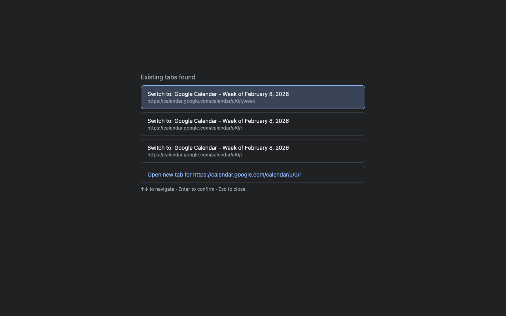

# Tab Dedup

> Automatically detects duplicate tabs and offers to switch to existing tabs instead of opening duplicates.

[](https://www.gnu.org/licenses/gpl-3.0)
[](https://github.com/kerryjones/tab-dedup)
[](https://github.com/kerryjones/tab-dedup/releases)



## Why?

If you're like most Chrome users, you have dozens of tabs open. Tab Dedup prevents duplicate tabs by intercepting new navigations and showing you existing tabs for the same domain. No more hunting through 50 tabs to find the one you just opened.

## Features

- 🎯 **Smart duplicate detection** - Matches by domain, handles redirects
- ⌨️ **Keyboard-first** - Full keyboard navigation (↑↓, Enter, Esc)
- ⚙️ **Configurable** - Domain aliases, disallow list, debug mode
- 🔒 **Privacy-first** - No tracking, no telemetry, open source
- 🔄 **Chrome Sync** - Settings sync across devices

## Installation

### From Chrome Web Store
*(Coming soon)*

### From Source
```bash
git clone https://github.com/kerryjones/tab-dedup.git
cd tab-dedup
# Load unpacked extension from chrome://extensions/
```

See [CONTRIBUTING.md](CONTRIBUTING.md) for detailed development setup.

## Usage

1. Open a new tab and navigate to any site
2. If a tab for that domain exists, the chooser appears
3. Use `↑↓` to select a tab, `Enter` to switch, or choose "Open new tab"
4. Press `Esc` to cancel

**Keyboard shortcuts:** `↑↓` Navigate • `Enter` Confirm • `Esc` Cancel

### Configuration

Right-click extension icon → **Options**

**Domain Aliases** - Map redirecting domains (e.g., `gmail.com = mail.google.com`)
**Disallow List** - Domains to exclude from duplicate detection (e.g., `google.com`, `localhost`)
**Debug Mode** - Enable console logging for troubleshooting

## Privacy

✅ No external servers
✅ No tracking or telemetry
✅ Open source and auditable

Read the full [Privacy Policy](PRIVACY.md).

## Contributing

Contributions welcome! Please see [CONTRIBUTING.md](CONTRIBUTING.md) for guidelines.

**Found a bug?** [Open an issue](https://github.com/kerryjones/tab-dedup/issues) with:
- Chrome version
- Steps to reproduce
- Console logs (enable debug mode in settings)

## License

[GNU General Public License v3.0](LICENSE) - ensures this extension stays open source and privacy-respecting forever.

---

Built with ❤️ for Chrome users who have too many tabs open.
